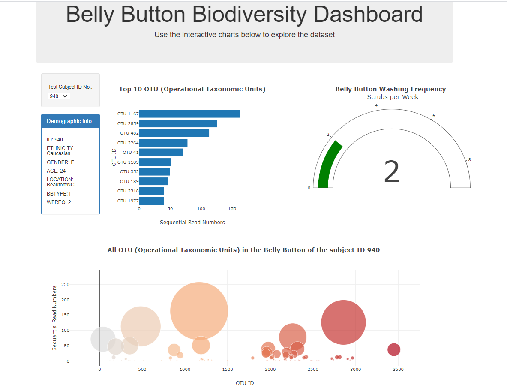

# Belly Button Biodiversity
 A study revealed that belly buttons are indeed a jungle of microbial diversity, having detected over 2300 species in those 60 navels. This project creates an interactive dashboard to visualize the findings of the study and make it available for the users.

## Tools and Technologies used
* JavaScript-Plotly, D3
* HTML
* Github Pages (for deployment)

## Data Source
Hulcr, J. et al.(2012) _A Jungle in There: Bacteria in Belly Buttons are Highly Diverse, but Predictable_. Retrieved from: [http://robdunnlab.com/projects/belly-button-biodiversity/results-and-data/](http://robdunnlab.com/projects/belly-button-biodiversity/results-and-data/)

## How to run the code
* Go to [this link](https://akshitap31.github.io/plotly-challenge/index.html)
and play around with different test subject IDs

## Output

